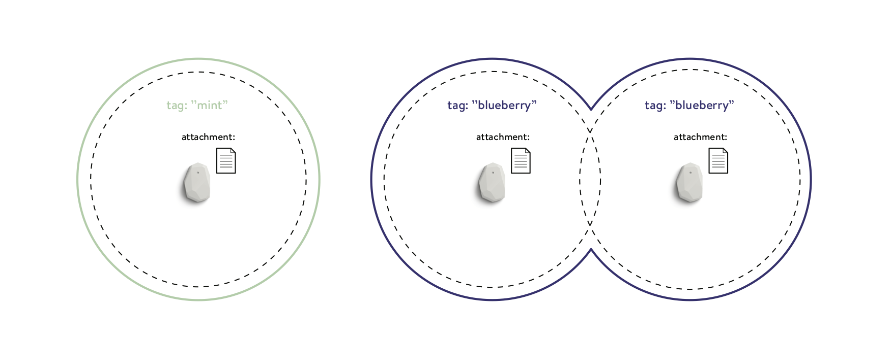
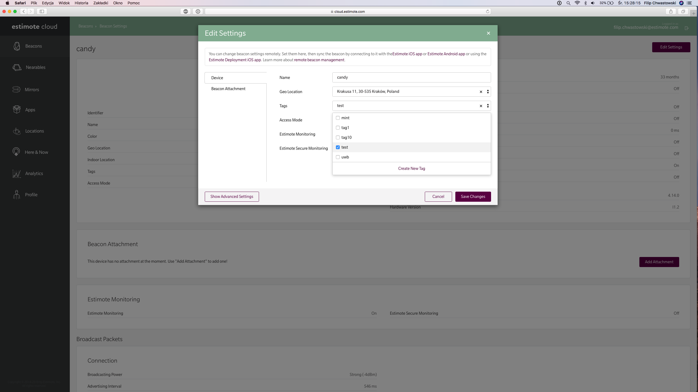

# Estimote Proximity SDK - iOS
Stick an Estimote Beacon at your desk, in your car, or on a package, and the Estimote Proximity SDK will let your app know when you enter or exit its range. Works indoors, in the background, and is accurate up to a few meters.

**Powered by Estimote Monitoring:** Estimote’s own signal-processing technology, with emphasis on maximum reliability. (up to 3 times better than other beacon-based technologies we’ve [benchmarked against][reliability-numbers])

[reliability-numbers]: http://blog.estimote.com/post/165007958785/launching-the-most-reliable-configurationless#better-reliability

Other Proximity SDK highlights include:

1. **Tag-based identification:** define your proximity zones with human-readable tags instead of abstract identifiers.
2. **Multiple zones per beacon:** set up more than one enter/exit zone per single beacon. (e.g., a “near” zone and a “far” zone)
3. **Software-defined range:** define the enter/exit trigger range in code, rather than by the beacon’s broadcasting power.
4. **Cloud-based tagging & grouping:** add, remove, and replace beacons, without changing the app’s code - just modify the tags in Estimote Cloud.

# Table of contents
- [Tag-based identification](#tag-based-identification)
- [Installation](#installation)
- [Use it in your app](#use-it-in-your-app)
    - [Setting up tags](#setting-up-tags)
    - [Inside your app](#inside-your-app)
- [(Optional) Adding attachments to your beacons](#optional-adding-attachments-to-your-beacons)
- [Location and Bluetooth permissions, Background support](#location-and-bluetooth-permissions-background-support)
- [Additional features](#additional-features)
- [Example apps](#example-apps)
- [Documentation](#documentation)
- [Your feedback and questions](#your-feedback-and-questions)
- [Changelog](#changelog)

## Tag-based identification
Estimote Proximity SDK uses tag-based identification to allow for dynamic setup changes.
You monitor beacons by tags, which you assign in Estimote Cloud. For example, instead of saying:
>"monitor for beacon 123 and beacon 456"

you say: 

>"monitor for beacons tagged as lobby". 

This way, if you need to replace or add more beacons to the lobby, you just add/change tags in Estimote Cloud. Your app will pick up the new setup the next time the `EPXProximityObserver` is started.
>**Important!**
>As our SDK is still in version 0.x.x, we're constantly modifying our API according to your feedback. Our latest iteration has evoloved our SDK to be based on simple tags, backed up with attachments as an optional additional information. 

### Key components
Estimote Proximity SDK is built on top of three key components: _observer_, _zone_, and _zone's context_. If you used previous versions of Proximity SDK you should be familiar with all of them except last one.
- _Observer_ - responsible for starting and stopping monitoring for a provided list of zones,
- _Zone_ - a representation for a physical space combining group of beacons with same _tag_.
- _Zone’s context_ - a combination of a single beacon with its tag and list of attachments assigned to it.
- _Actions (callbacks)_ - every _zone_ has three types of callbacks triggered when you: enter a _zone's context_, exit it, or number of heard _contexts_ changes.

Below there's a presentation of two zones:
- `blueberry` zone with two _zone's contexts_,
- `mint`zone with only one _zone's context_.



<p align="center">
    <i>Tag-based zones</i>
</p>

## Installation

### Swift compatibility

Starting with [version 1.2.0](https://github.com/Estimote/iOS-Proximity-SDK/releases/tag/v1.2.0) Proximity SDK supports Swift 4.2.

### CocoaPods 
[CocoaPods](https://cocoapods.org/) is an easy way to add external libraries. To use it to fetch Proximity SDK:
1. Add `pod 'EstimoteProximitySDK'` to your Podfile
1. Run `pod install --repo-update`
1. Make sure _Always Embed Swift Standard Libraries_ build setting is set to **Yes** (this option is turned off by default for Objective–C projects). Estimote Proximity SDK contains Swift code internally and requires Swift standard libraries in the app bundle.
1. Add `import EstimoteProximitySDK` (Swift) or  `#import <EstimoteProximitySDK/EstimoteProximitySDK.h>` (Objective–C) to your code

### Manual
1. Download Proximity SDK repository
    - Click the _Download ZIP_ button in this repo, or
    - Run `git clone git@github.com:Estimote/iOS-SDK-Proximity-SDK.git --depth=1`
1. Download Bluetooth Scanning library repo
    - Click the _Download ZIP_ button in [Bluetooth Scanning repo](https://github.com/Estimote/iOS-Bluetooth-Scanning), or
    - Run `git clone git@github.com:Estimote/iOS-Bluetooth-Scanning.git --depth=1`
1. Drag & drop [EstimoteProximitySDK.framework](EstimoteProximitySDK/EstimoteProximitySDK.framework) to your project (enable the checkbox in _Options_ > _Copy files if needed_)
1. Drag & drop [EstimoteBluetoothScanning.framework](EstimoteProximitySDK/EstimoteBluetoothScanning.framework) to your project (enable the checkbox in _Options_ > _Copy files if needed_)
1. Add Estimote Proximity SDK to your Xcode project's _Build Phases_ > _Embed Frameworks_. If this build phase isn't visible you can add the SDK in _General_ -> _Embedded Binaries_ section.
1. Add Estimote Bluetooth Scanning library to your Xcode project's _Build Phases_ > _Embed Frameworks_. If this build phase isn't visible you can add the SDK in _General_ -> _Embedded Binaries_ section.
1. Make sure _Always Embed Swift Standard Libraries_ build setting is set to **Yes** (this option is turned off by default for Objective–C projects). Estimote Proximity SDK contains Swift code internally and requires Swift standard libraries in the app bundle.
1. Add `import EstimoteProximitySDK` (Swift) or  `#import <EstimoteProximitySDK/EstimoteProximitySDK.h>` (Objective–C) to your code

## Use it in your app
The library is compatible with both Objective–C and Swift. The public-facing classes are written in Objective–C, the API is optimized for Swift. It's distributed as a dynamic framework.
### Requirements
- One or more [Estimote Proximity Beacons](https://estimote.com/products/) with Estimote Monitoring enabled. Here’s [how to enable it.](https://community.estimote.com/hc/en-us/articles/226144728-How-to-enable-Estimote-Monitoring) 
- An iOS device with Bluetooth Low Energy running iOS 10 or later. Using BLE with iOS Simulator isn't supported.
- An Estimote Cloud account.

### Setting up tags
To configure the tags:
1. Go to https://cloud.estimote.com/#/
1. Click on the beacon you want to configure
1. Click _Edit Settings_ button
1. Click _Tags_ field and a drop down list with (if applicable) existing tags.
1. Either click _Create New Tag_ at the bottom of the list and enter a name or select a tag (as many as you want/have).
1. Click _Save Changes_

>Tags are Cloud-only settings — no additional connecting to the beacons with the Estimote app is required!



<p align="center">
    <i>Assigning beacon tags</i>
</p>

### Inside your app
To use the SDK within your app, go to the [apps section](https://cloud.estimote.com/#/apps) in Estimote Cloud. Register a new app or use one of the available templates to obtain App ID & App Token credentials pair.
In your app, set up the credentials using `CloudCredentials`:
```swift
let credentials = CloudCredentials(appID: "your-app-id", appToken: "your-app-token")
```
Then, configure proximity discovery with `ProximityObserver`. For more info on tags, see [this section](#tag-based-identification) or [documentation](#documentation).
```swift
// Create observer instance
self.proximityObserver = ProximityObserver(credentials: credentials, onError: { error in
    print("Oops! \(error)")
})
// Define zones
let blueberryZone = ProximityZone(tag: "blueberry", range: ProximityRange.near)
blueberryZone.onEnter = { zoneContext in
    print("Entered near range of tag 'blueberry'. Attachments payload: \(zoneContext.attachments)")
}
blueberryZone.onExit = { zoneContext in
    print("Exited near range of tag 'blueberry'. Attachment payload: \(zoneContext.attachments)")
}

blueberryZone.onContextChange = { contexts in
    print("Now in range of \(contexts.count) contexts")
}

// ... etc. You can define as many zones as you need.

// Start proximity observation
self.proximityObserver.startObserving([blueberryZone])
```


### (Optional) Adding attachments to your beacons
While zone identification is based on tags, attachments are a way to add additional content to a beacon and a zone it defines. Think of it as a custom backend where you can assign any additional data to a particular beacon.
All attachments assigned to a beacon will be available in `EPXproximityZoneContext` objects returned in action's callback. See [EPXProximityZone](https://github.com/Estimote/iOS-Proximity-SDK-Source/blob/feature/tags_readme/EstimoteProximitySDK/EstimoteProximitySDK/PublicClasses/EPXProximityRange.h) for more details.

To configure the attachments:
1. Go to https://cloud.estimote.com/#/
1. Click on the beacon you want to configure
1. Click _Settings_ button
1. Click _Beacon Attachment_ field
1. Add any attachment key-value pair you want
1. Click _Save Changes_

>Attachments are Cloud-only settings — no additional connecting to the beacons with the Estimote app is required!


<p align="center">
<i>Assigning beacon attachments</i>
</p>

## Location and Bluetooth permissions, Background support

Proximity SDK requires Location Services to work in the background, which means you need to ask users to allow the app to access their location. To do that, **set up the Location Services usage description**:

- Add a value for _Privacy - Location Always Usage Description_ key in your app's Info.plist file. This message will be shown to the user when the app calls `ProximityObserver.startObserving(...)`. It's ***required*** for Core Location to work.

Proximity SDK uses Bluetooth, which means you need to ask users to allow the app to access bluetooth. To do that, **set up Bluetooth usage description**:

- Add a value for _Privacy - Bluetooth Always Usage Description_ key in your app's Info.plist file.

To allow our app to run in the background when in range of beacons, **enable the Bluetooth Background Mode**:

- Set _Uses Bluetooth LE accessories_ in your Xcode project settings -> _Capabilities_ -> _Background Modes_. It's ***required*** for Core Bluetooth to work in the background.
## Additional features

### Caching data for projects with limited internet connectivity.
Starting with version [0.13.0](https://github.com/Estimote/iOS-Proximity-SDK/releases/tag/v0.13.0), ProximityObserver can store the data necessary for triggering events locally. This allows for performing the typical proximity observation when there is no internet access later on. To enable this, you only need to call `ProximityObserver.startObserving([zone1,...])` instance at least once when the internet connection is available - it will then fetch all the necessary data from the Estimote Cloud.

### Scanning for Estimote Telemetry

>Use case: Getting sensors data from your Estimote beacons.

Starting with version [1.1.0](https://github.com/Estimote/iOS-Proximity-SDK/releases/tag/v1.1.0) `ProximityObserverConfiguration` has exposed properties, one of which allows for reporting telemetry data to Estimote Cloud.

You can easily scan for raw Estimote Telemetry packets that contain your beacons' sensor data. Telemetry is broadcasted in two separate sub-packets, called _frame A_ and _frame B_. Proximity SDK allows you to scan for the whole merged data at once (containing _frame A_ and _B_ data, and also the full device identifier). Reporting telemetry is enabled by default, but if for any reason you would like to disable this feature, perform the following to stop telemetry reporting:

```swift
let proximityConfiguration = ProximityObserverConfiguration.custom(with: .info, requestsCLAuthorization: true, telemetryReportingEnabled: false)
```

## Example apps

To get a working prototype, download a [ready-made app template](https://cloud.estimote.com/#/apps/add) in the Estimote Cloud. 
App ID & App Token credentials are generated automatically.

- Use [Proximity](https://cloud.estimote.com/#/apps/add/proximity-content-multiple) to run a simple demo in the foreground.
- Use [Notification](https://cloud.estimote.com/#/apps/add/notification) to run a demo in the background and display notifications.

Demos require Estimote Beacons [configured with Estimote Monitoring](https://community.estimote.com/hc/en-us/articles/226144728-How-to-enable-Estimote-Monitoring)

## Documentation
[Here](https://estimote.github.io/iOS-Proximity-SDK) you will find documentation.

## Your feedback and questions
At Estimote we're massive believers in feedback! Here are some common ways to share your thoughts with us:
- Posting issue/question/enhancement on our [issues page](https://github.com/Estimote/iOS-Proximity-SDK/issues).
- Asking our community managers on our [forum](https://forums.estimote.com/c/proximity).

## Changelog
To see what has changed in recent versions of our SDK, see the [CHANGELOG](https://github.com/Estimote/iOS-Proximity-SDK/blob/master/CHANGELOG.md).
