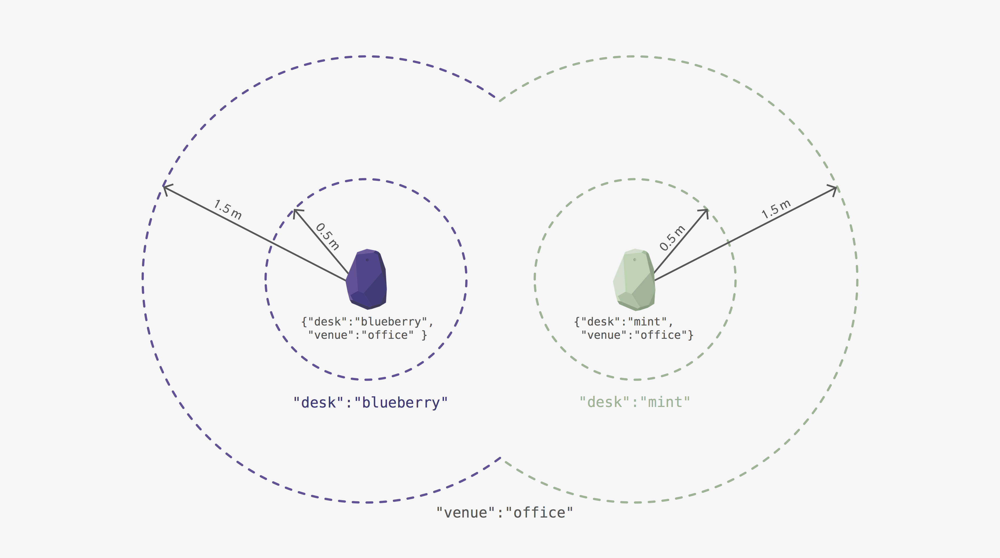
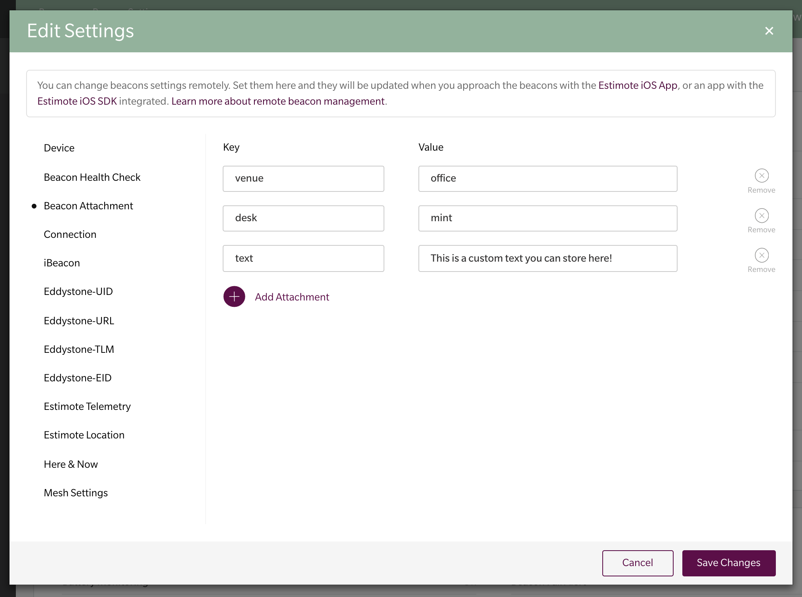

# iOS-Proximity-SDK
Estimote Proximity SDK for iOS

## Introduction

Estimote Proximity SDK aims to provide a simple way for apps to react to physical context by reading signals from [Estimote Beacons](https://estimote.com/products/). It uses Core Bluetooth and Core Location frameworks to provide the best beacon-based experience possible.

Note: this project was previously known as [Estimote SDK 5.0.0](https://github.com/Estimote/iOS-SDK/tree/sdk_5).

### Why should you use it

1. Reliability. It's built upon [Estimote Monitoring](http://blog.estimote.com/post/163745555265/estimote-monitoring-20-with-even-better-accuracy), Estimote's algorithm for reliable enter/exit reporting.
2. No need to operate on abstract identifiers, or Proximity UUID, Major, Minor triplets. Estimote Proximity SDK lets you define zones by setting predicates for human-readable JSONs.
3. You can define multiple zones for a single beacon, i.e. at different ranges.
4. Cloud-backed grouping. When you change your mind and want to replace one beacon with another, all you need to do is reassign JSON attachments in Estimote Cloud. You don't even need to connect to the beacon!

## Installation

### CocoaPods 

[CocoaPods](https://cocoapods.org/) is an easy way to add external libraries. To use it to fetch Proximity SDK:

1. Add `pod 'EstimoteProximitySDK'` to your Podfile

1. Run `pod install --repo-update`

1. Make sure _Always Embed Swift Standard Libraries_ build setting is set to **Yes** (this option is turned off by default for Objective–C projects). Estimote Proximity SDK contains Swift code internally and requires Swift standard libraries in the app bundle.

1. Add `import EstimoteProximitySDK` (Swift) or  `#import <EstimoteProximitySDK/EstimoteProximitySDK.h>` (Objective–C) to your code

### Manual

1. Download Proximity SDK repository
    - Click the "Download ZIP" button in this repo, or
    - Run `git clone git@github.com:Estimote/iOS-SDK-Proximity-SDK.git --depth=1`

1. Download Bluetooth Scanning library repo
    - Click the "Download ZIP" button in [Bluetooth Scanning repo](https://github.com/Estimote/iOS-Bluetooth-Scanning), or
    - Run `git clone git@github.com:Estimote/iOS-Bluetooth-Scanning.git --depth=1`

1. Drag & drop [EstimoteProximitySDK.framework](EstimoteProximitySDK/EstimoteProximitySDK.framework) to your project (enable the checkbox in _Options_ > _Copy files if needed_)

1. Drag & drop [EstimoteBluetoothScanning.framework](EstimoteProximitySDK/EstimoteProximitySDK.framework) to your project (enable the checkbox in _Options_ > _Copy files if needed_)

1. Add Estimote Proximity SDK to your Xcode project's _Build Phases_ > _Embed Frameworks_. If this build phase isn't visible you can add the SDK in _General_ -> _Embedded Binaries_ section.

1. Add Estimote Bluetooth Scanning library to your Xcode project's _Build Phases_ > _Embed Frameworks_. If this build phase isn't visible you can add the SDK in _General_ -> _Embedded Binaries_ section.

1. Make sure _Always Embed Swift Standard Libraries_ build setting is set to **Yes** (this option is turned off by default for Objective–C projects). Estimote Proximity SDK contains Swift code internally and requires Swift standard libraries in the app bundle.

1. Add `import EstimoteProximitySDK` (Swift) or  `#import <EstimoteProximitySDK/EstimoteProximitySDK.h>` (Objective–C) to your code

## Requirements

- One or more [Estimote Proximity or Location Beacons](https://estimote.com/products/) configured for Estimote Monitoring. It's enabled by default in dev kits shipped after mid-September 2017; to enable it on your own check out the instructions.
- An iOS device with Bluetooth Low Energy running iOS 10 or later. Using BLE with iOS Simulator isn't supported.

## Usage

The library is compatible with both Objective–C and Swift. The public-facing classes are written in Objective–C, the API is optimized for Swift. It's distributed as a dynamic framework.

## Attachment-based identification

Details of each of your Estimote devices are available in [Estimote Cloud](https://cloud.estimote.com/#/). Each device has a unique identifier, but remembering it and using it for every one of your devices can be challenging. This is why Estimote Proximity SDK uses attachment-based identification.

Each device has an associated JSON. When the SDK detects a proximity change of a device, it checks the device's attachment JSON to see which registered rule should be applied.

### Example

To get a working prototype, check out the [Desk Observer](Examples/Swift/DeskObserver) example app. It's a single screen app with three labels that change background color:
- when you are in close proximity to the first desk, 
- in close proximity to the second desk, 
- when you are in the venue in general.

The demo requires at least two Proximity or Location beacons configured for Estimote Monitoring.

The demo expects beacons having specific tags assigned:
- `{"attachment":{"desk":"blueberry","venue":"office"}}` for the first one,
- `{"attachment":{"desk":"mint","venue":"office"}}` for the second one.

These attachments can be used to define the zones presented below:



<p align="center">
    <i>Attachment-based zones</i>
</p>

To conifgure the attachments:
1. Go to https://cloud.estimote.com/#/
1. Click on the beacon you want to configure
1. Click _Settings_ button
1. Click _Beacon Attachment_ field
1. Add any attachment key-value pair you want
1. Click _Save Changes_

Tags are Cloud-only settings — no additional connecting to the beacons with the Estimote app is required!



<p align="center">
    <i>Assigning beacon attachments</i>
</p>

### Inside your app

To use the SDK within your app, go to the [apps section](https://cloud.estimote.com/#/apps) in Estimote Cloud. Register a new app or use one of the available templates to obtain App ID & App Token credentials pair.

In your app, set up the credentials using `ESTCloudCredentials`:

```swift
let credentials = EPXCloudCredentials(appID: "your-app-id", appToken: "your-app-token")
```

Then, configure proximity discovery with `EPXProximityObserver`. For more info on attachments, see [this section](#attachment-based-identification).

```swift
// Create observer instance
self.proximityObserver = EPXProximityObserver(credentials: credentials, errorBlock: { error in
    print("Ooops! \(error)")
})


// Define zones
let blueberryZone = EPXProximityZone(range: EPXProximityRange.custom(meanTriggerDistance: 0.5)!,
                                     attachmentKey: "desk",
                                     attachmentValue: "blueberry")
blueberryZone.onEnterAction = { attachment in
    print("Entered near range of 'desk':'blueberry'. Attachment payload: (attachment.payload)")
}
blueberryZone.onExitAction = { attachment in
    print("Exited near range of 'desk':'blueberry'. Attachment payload: (attachment.payload)")
}

// ... etc. You can define as many zones as you need.

// Start proximity observation
self.observer.startObserving([blueberryZone])
```

### Background support

To allow your app to react to physical context when it's in the background:
- Set _Uses Bluetooth LE accessories_ in your Xcode project settings -> _Capabilities_ -> _Background Modes_. It's required for Core Bluetooth to work in the background.
- Add a value for _Privacy - Location Always Usage Description_ key in your app's Info.plist file. It will be the message of an alert that will be shown to the user when the app calls `-[EPXProximityObserver start...]`. It's required for Core Location to work.
